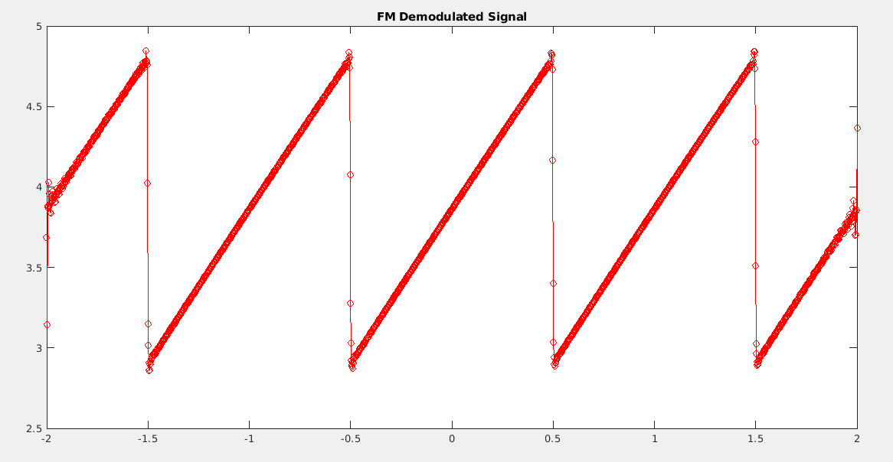

Question 1
==========

In this question, I'll implement a QAM modulator-demodulator system. The
QAM modulator allows us to transmit two spearate signals on same
channel. For transmitting part, we are multiplying message singnals with
two different sine and cosine carrier signals. These signals create a
channel signal without any overlapping on frequency responses of
original signals. For the receiver part, we simply multiply incoming
signal with signals that we multiplied on the transmitter part to
receive frequency response of original message. In the end, we simply
perform a low pass filtering operation to cancel other frequencies.

1.  

    Q1.a
    ----

This is our modulated signal that carries both of our message signals in
time domain. In order to generate this signal, we multiplied our message
signals with sign and cosine signals separately. In this way, we can
transmit two seperate signals over same channel.

{width="6.6930555555555555in"
height="3.5034722222222223in"}

6.  Q1.b
    ----

     

{width="6.6930555555555555in"
height="3.428472222222222in"}

This is the QAM modulated signal in frequency domain You can find the
hand calculations below. Spectrum matches with my hand calculation.

{width="6.6930555555555555in" height="3.525in"}

8.  

    Q1.c
    ----

In order to receive original signals, we need to multiply incoming
singnal with the encoding signals that we used in transmitter part.
After seperate multiplications, we can see the frequency reponses of the
demodulated signals.

{width="6.6930555555555555in"
height="3.4631944444444445in"}

{width="6.6930555555555555in"
height="3.4298611111111112in"}

From the graphs above, we can see that our demodulator and modulator
seems to work quite good. The only thing left for us to do is remove
those frequency components at the edge of the spectrum. We can see that
our signals lies between 0-50 plane for both sides. So we can use a low
pass filter which has a stopband frequency at 50Hz.

{width="6.6930555555555555in"
height="3.2534722222222223in"}

Here is the magnitude response of our low pass filter. This low pass
filter will remove all components which have a frequency is greater than
50 hz.

Q1.d
----

{width="3.3604166666666666in"
height="1.7972222222222223in"}

Here we can see the recovered and original signals. Since they are
almost same, it means QAM modulator and demodulator working quite good.

Q2.a
----

{width="6.6930555555555555in" height="3.0125in"}

Here we can see the both USB and LSB modulated signals in time domain.
Main purpose of DSB modulation is to transfer only upper of lower part
of the signal since they are both same. This allows us to transmit
signals with small amounth of energy.

Q2.b
----

{width="6.6930555555555555in"
height="2.973611111111111in"}Here we can see the frequency spectrums of
both signals. As we predicted, these signals have same spectrums. This
means we can regenerate original signal from only one of these signals.

Q2.c
----

{width="6.6930555555555555in"
height="3.5131944444444443in"}

{width="6.6930555555555555in"
height="4.339583333333334in"}In this graph, we can see the our origial
and ssb-recovered signals. Since they are almost same, our modulator and
demodulator seems working.

After analyzing frequency spectrum of demodulated LSB signal, I decided
to use the filter that I used for first question. Since we do not have
any required components to reconstruct our signal that have a frequency
greater than 50 Hzi this filter will fit for our system.

{width="6.6930555555555555in"
height="3.4430555555555555in"}

This is the frequency spectrum for LSB demodulated signal. We can see
the components at 2 and 6 Hz. These component are needed for
reconstruction of our original signal. To remove other unwanted
components, we need to use the low pass filter with graph given above.

Q2.d
----

{width="6.6930555555555555in"
height="3.459722222222222in"}

From the graph above we can see that frequency components of demodulated
and original signals are almost the same.

Q3.a
----

For this part of the project, I have used formulas and functions written
in Week 2 lab session. A little modification was needed for this
question.

{width="6.6930555555555555in"
height="3.446527777777778in"}This is the sawtooth singnal created by
sawtooth function on matlab. I have shifted its frequency by 0.5 so
it'll make integral calculations easy.

Q3.b
----

{width="6.6930555555555555in"
height="3.4145833333333333in"}Here we can see that all of the five
coeffients are matching with the signal spectrum components.

Q3.c
----

{width="6.6930555555555555in"
height="3.595138888888889in"} Here we can see the frequency modulation
of our sawtooth signal. In frequency modulation, freqency is dependent
to the value of the function. Higher value means higher frequency. We
can see that the frequency of modulated signal is higher when the
sawtooth signal has value close to one.

Q3.d
----

{width="6.6930555555555555in"
height="3.466666666666667in"}Here is the demodulated FM signal that we
calculed on previous step. Demodulation is done by an envelope detector.
